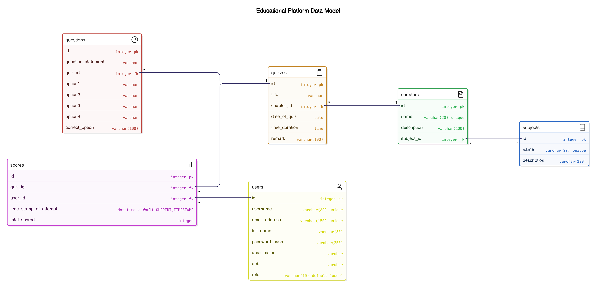

# quiz-master-app-v1

## Overview
`quiz-master-app-v1` is a multi-user application designed to act as an exam preparation site for multiple courses. It supports different user roles, including administrators (quiz-masters) and regular users. The application allows users to attempt quizzes, view results, and search for various entities within the system.

## Features
- **User Authentication**: Secure login and registration for users.
- **Role-Based Access Control**: Different functionalities for quiz-masters and regular users.
- **Quiz Management**: Create, update, and delete quizzes.
- **Question Management**: Add, update, and delete questions for quizzes.
- **Search Functionality**: Search across multiple tables (Users, Chapters, Subjects, Quizzes, Questions).
- **Session Management**: Track quiz attempts and store answers.
- **Error Handling**: Custom error pages for better user experience.

## Installation
1. Clone the repository:
    ```bash
    git clone https://github.com/eabhi-me/quiz-master-app-v1.git
    cd quiz-master-app-v1
    ```

2. Create a virtual environment and activate it:
    ```bash
    python -m venv venv
    venv\Scripts\activate  # On Windows
    source venv/bin/activate  # On macOS/Linux
    ```

3. Install the required dependencies:
    ```bash
    pip install -r requirements.txt
    ```

4. Set up the database:
    ```bash
    flask db init
    flask db migrate
    flask db upgrade
    ```

5. Run the application:
    ```bash
    flask run
        or
    python app.py
    ```

## Usage
- :**Register** Create a new user account.
- **Login**: Access the application with your credentials.
- **Quiz Master**: Create and manage quizzes and questions.
- **User**: Attempt quizzes and view results.
- **Search**: Use the search bar to find users, chapters, subjects, quizzes, and questions.

## Routes
- **Home**: `/`
- **Register**: `/register`
- **Login**: `/login`
- **Attempt Quiz**: `/attempt-quiz/<int:quiz_id>`
- **View Result**: `/view-result/<int:quiz_id>`
- **Search**: `/search`

### User Routes
- **Dashboard**: `/dashboard` - View upcoming and old quizzes.
- **View Quiz**: `/view-quiz/<int:quiz_id>` - View details of a specific quiz.
- **Attempt Quiz**: `/attempt-quiz/<int:quiz_id>` - Attempt a specific quiz.
- **Quiz Result**: `/quiz-result/<int:quiz_id>` - View the result of a specific quiz attempt.
- **View Result**: `/view-result` - View all quiz results for the current user.
- **User Summary**: `/summary/user` - View a summary of the user's performance.

### Quiz Master Routes
- **Quiz Master Dashboard**: `/quiz-master/admin` - View statistics and manage the quiz master dashboard.
- **Manage Users**: `/quiz-master/manage-user` - View and manage users.
- **Get User**: `/quiz-master/user/<int:user_id>` - Get details of a specific user.
- **Delete User**: `/quiz-master/user/<int:user_id>` - Delete a specific user.
- **Quiz Master Actions**: `/quiz-master/action-sub-chap` - View and manage subjects and chapters.
- **View Quizzes**: `/quiz-master/quiz-dashborad` - View all quizzes and questions.
- **Add Subject**: `/quiz-master/add-subject` - Add a new subject.
- **Add Chapter**: `/quiz-master/add-chapter` - Add a new chapter.
- **Add Quiz**: `/quiz-master/add-quiz` - Add a new quiz.
- **Add Question**: `/quiz-master/add-question` - Add a new question.
- **Modify Subject**: `/quiz-master/subject/<int:id>` - Modify or delete a specific subject.
- **Modify Chapter**: `/quiz-master/chapter/<int:id>` - Modify or delete a specific chapter.
- **Modify Quiz**: `/quiz-master/quiz/<int:id>` - Modify or delete a specific quiz.
- **Modify Question**: `/quiz-master/question/<int:id>` - Modify or delete a specific question.
- **Edit Question**: `/quiz-master/edit-question/<int:id>` - Edit a specific question.
- **Edit Quiz**: `/quiz-master/edit-quiz/<int:id>` - Edit a specific quiz.
- **Summary**: `/summary` - View a summary of the quiz master's performance.


## API Documentation
The API documentation is available at the following link:
- **Swagger UI**: [API Documentation](http://localhost:5000/apidocs)


## Error Handling
- **404 Not Found**: Custom error page for non-existent routes.

## Database Schema


## IMG


## Video
[Demo](https://drive.google.com/file/d/1G0daZUMvVMMxDb9tJ6JSw2CJwHmIZEJ7/view?usp=drive_link)

<iframe width="560" height="315" src="https://drive.google.com/file/d/1G0daZUMvVMMxDb9tJ6JSw2CJwHmIZEJ7/view?usp=sharing" frameborder="0" allow="autoplay; encrypted-media" allowfullscreen></iframe>

## Contributing
1. Fork the repository.
2. Create a new branch (`git checkout -b feature-branch`).
3. Make your changes.
4. Commit your changes (`git commit -m 'Add new feature'`).
5. Push to the branch (`git push origin feature-branch`).
6. Create a new Pull Request.

## License
This project is licensed under the MIT License.

## Contact
For any questions or feedback, please contact [eabhi.me@gmail.com].